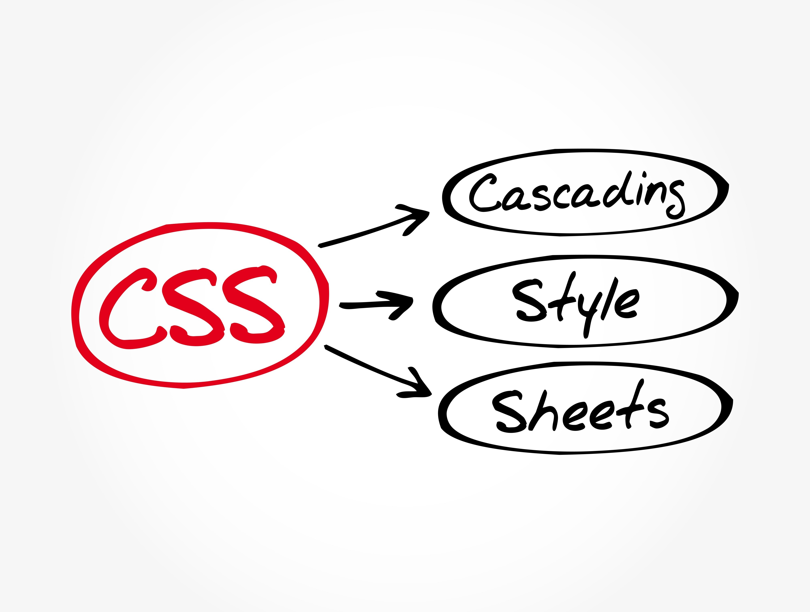

# CSS
## 1. Su Uso: La Puesta en Escena de la Web
CSS (Cascading Style Sheets, u Hojas de Estilo en Cascada) es el lenguaje esencial que trabaja en conjunto con HTML para la presentación visual de una página web.

Su función principal es tomar los elementos estructurales definidos en HTML y dotarlos de estilo. Esto incluye:

> 1. Definir el diseño (posición, layout).

> 2. Controlar la tipografía (fuentes, tamaños).

> 3. Asignar colores y fondos.

> 4. Gestionar animaciones y efectos visuales.

El objetivo es transformar una estructura básica de HTML en una interfaz atractiva, funcional y coherente.

**Dato Crucial: Interdependencia de Propiedades**

Es vital recordar que en CSS, muchas propiedades no funcionan de forma aislada. Algunas requieren que se definan otras propiedades complementarias.

Ejemplo: Para que las propiedades de posicionamiento como top, bottom, left o right tengan efecto, el elemento debe tener previamente un valor de position (como absolute o relative) definido.


## 2. El Significado de "Cascada" en CSS
CSS, que significa Hojas de Estilo en Cascada (Cascading Style Sheets), lleva ese nombre debido al algoritmo que utiliza el navegador para resolver conflictos cuando múltiples reglas de estilo intentan aplicarse al mismo elemento HTML.

Imagina una cascada de agua: el agua que cae desde arriba es afectada por lo que encuentra más abajo. En CSS, las reglas que están "más abajo" (o son más importantes) pueden reescribir o anular las reglas definidas "más arriba" o antes.

Shutterstock


El navegador determina qué estilo "gana" y finalmente se aplica a un elemento basándose en tres factores principales que actúan en un orden específico, como una cascada:

## 3. Origen de la Regla: ¿De dónde viene el estilo?

> - Estilos del navegador (por defecto).

> - Estilos del usuario (si tiene hojas de estilo personalizadas).

> - Estilos del Autor (tu código CSS).

> - Y, en última instancia, las declaraciones marcadas con !important.

## 4. Especifidad

**Especificidad del Selector**
Es el factor más común. Se calcula mediante una "puntuación" para ver qué selector es más preciso.

> - Un selector por ID (#mi-id) es más específico que...

> - Un selector por Clase (.mi-clase), que a su vez es más específico que...

> - Un selector por Etiqueta (p).

Cuanto más específico es un selector, más peso tiene su estilo, sin importar dónde esté escrito en el archivo.

### Dato a tener en cuenta

> - Orden de Aparición: Si la Especificidad de dos reglas en conflicto es exactamente la misma (por ejemplo, dos reglas con la misma clase), entonces gana la regla que aparece en último lugar en la hoja de estilos.

En resumen, la "cascada" es el proceso de toma de decisiones que sigue el navegador para aplicar el estilo final. Si una regla más específica o que aparece más tarde entra en conflicto con una anterior, la nueva reescribe la propiedad, dando la impresión de un flujo de estilos que se van superponiendo.

## 5. Diferencia entre propiedades y atributos


### 5. 1. Atributos (HTML)

Un **Atributo** se utiliza en **HTML**. Define las características, identidad o comportamiento inicial de un elemento.

* **Ubicación:** Dentro de la etiqueta de apertura de un elemento HTML.
* **Sintaxis:** `nombre="valor"`
* **Función:** Describe, identifica o modifica el comportamiento por defecto.

**Ejemplos de Atributos:**

| Atributo | Uso en HTML | Explicación |
| :--- | :--- | :--- |
| `class` | `<div class="destacado">...</div>` | Le da una **clase** al elemento para seleccionarlo desde CSS o JS. |
| `id` | `<h1 id="titulo-principal">...</h1>` | Le da una **identidad única** al elemento dentro de la página. |
| `href` | `<a href="contacto.html">Contacto</a>` | Especifica la **dirección** de destino del enlace. |
| `src` | `` | Especifica la **fuente** del archivo (imagen, video, etc.). |

### 5. 2. Propiedades (CSS)

Una **Propiedad** se utiliza en **CSS**. Define el estilo visual y la disposición que se aplicará a los elementos seleccionados.

* **Ubicación:** Dentro de las reglas de estilo de CSS (`selector { ... }`).
* **Sintaxis:** `propiedad: valor;`
* **Función:** Controla cómo se **ve** (color, fuente) y cómo se **dispone** (espaciado, caja) el elemento.

**Ejemplos de Propiedades:**

| Propiedad | Valor de CSS | Explicación |
| :--- | :--- | :--- |
| `color` | `color: red;` | Establece el **color del texto** del elemento. |
| `font-size` | `font-size: 16px;` | Establece el **tamaño de la fuente**. |
| `margin` | `margin: 10px;` | Define el **espacio exterior** alrededor del elemento (fuera del borde). |
| `display` | `display: flex;` | Define cómo debe comportarse el elemento a nivel de caja (bloque, línea, flexible, etc.). |

### 5. 3. El Caso Especial: El Atributo `style`

Cuando se aplica CSS directamente en la etiqueta HTML (estilos en línea), el concepto se combina:

```html
<p style="color: blue; font-size: 20px;">
    Texto con estilos en línea.
</p> 
```
## 6. Forma de enlazar CSS

### 6. 1. Estilos en línea.
Se llama así porque normalmente se dan estilos en línea.
```html
<p style="color: blueviolet; font-size: 20px;">Lorem ipsum dolor sit amet consectetur adipisicing elit. Dolorum assumenda ad a explicabo esse tempore vero vel harum porro at ipsa qui eligendi, suscipit vitae delectus, quasi sint modi pariatur?</p>
```
**Mala práctica.**

Se recomienda tener un lenguaje por un lado y otro lenguaje por otro lado. No se puede tener todo mezclado, ya se por organización o por comodidad.
Por eso se recomienda tener *style* como etiqueta.
**Ejemplo**

```html
<style>
    p {
        color: aquamarine;
    }
    h1 {
        color: red;
    }
</style>
```
*Sin embargo esta forma tampoco se recomienda. **Lo que si se recomienda es tener todos los estilos en un archivo aparte llamado "styles.css"***

**Buena práctica**

Se recomienda usar una etiqueta *<link>*, que como su nombre lo dice linkea una hoja de  estilos. Dicha etiqueta se ubica en el *<head>*.
```html
<head>
    <meta charset="UTF-8">
    <meta name="viewport" content="width=device-width, initial-scale=1.0">
    <link rel="stylesheet" href="styles.css">
    <title>Enlazando CSS</title>
</head>
```
#### Repaso

##### Formas de modificar propiedades

1.Selección por elemento.
*Estructura*
    
    selector {
    Nombre de la propiedad : valor de la propiedad 
    }
Ejemplo:
```css
selector {
    Nombre de la propiedad : valor de la propiedad 
    }
h1 {
    color: brown;
}
```
## 7. Selectores básicos.

